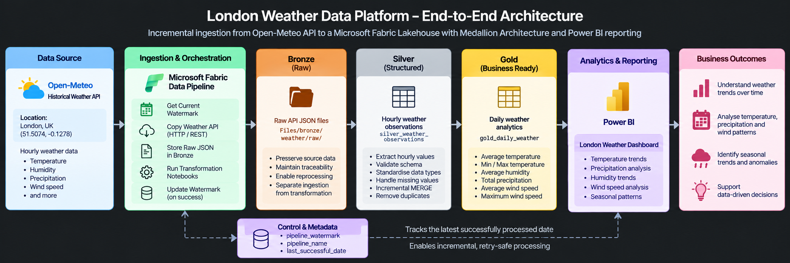
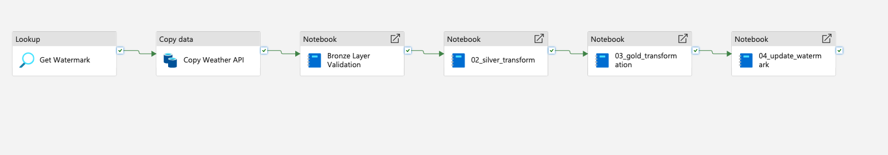
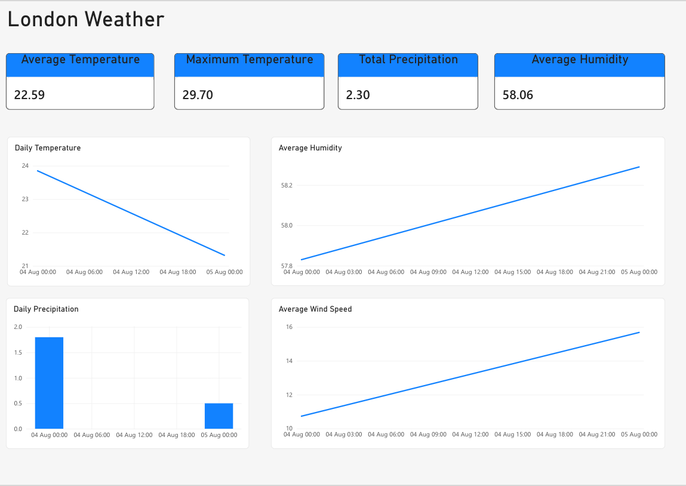

# London Weather Data Platform

Microsoft Fabric weather data engineering portfolio project.
# London Weather Data Platform

An end-to-end data engineering project built in **Microsoft Fabric** that ingests historical London weather data from the **Open-Meteo API**, processes it through a Bronze/Silver/Gold Lakehouse architecture, and serves business-ready daily weather metrics to **Power BI**.

The project demonstrates API ingestion, pipeline orchestration, PySpark transformations, Delta Lake, data-quality validation, incremental processing and watermark-based state management.

---

## Architecture



```text
Open-Meteo API
      ↓
Fabric Data Pipeline
      ↓
Bronze — Raw JSON
      ↓
Silver — Hourly Weather Observations
      ↓
Gold — Daily Weather Metrics
      ↓
Power BI
```

A persistent watermark table tracks the **last successfully processed date**, allowing the pipeline to determine which date should be processed next.

---

## Technology Stack

- Microsoft Fabric
- Fabric Data Pipelines
- Fabric Lakehouse / OneLake
- Apache Spark
- PySpark
- Delta Lake
- REST API / JSON
- Power BI
- Git / GitHub

---

## Project Objective

The objective was to build an incremental weather data platform rather than simply analyse a static dataset.

The solution needed to:

- Retrieve historical weather observations from an external API
- Preserve raw source responses
- Validate incoming data before transformation
- Create structured hourly observations
- Produce business-ready daily weather metrics
- Support safe repeated processing
- Maintain incremental pipeline state
- Expose curated data through Power BI

See [`documentation/business-requirements.md`](documentation/business-requirements.md) for the full requirements.

---

## Data Pipeline

The Fabric pipeline orchestrates the complete processing workflow.



```text
Get Watermark
      ↓
Copy Weather API
      ↓
Bronze Layer Validation
      ↓
02_silver_transform
      ↓
03_gold_transformation
      ↓
04_update_watermark
```

The watermark update is placed at the end of the processing chain so pipeline state represents successfully processed data rather than simply retrieved data.

---

## Medallion Architecture

### Bronze — Raw

Historical weather data is retrieved from the Open-Meteo API and stored as raw JSON in the Fabric Lakehouse.

The raw response is retained to provide:

- Source traceability
- Reprocessing capability
- Separation between ingestion and transformation
- A recovery/debugging point

Before Silver processing, the Bronze validation notebook confirms that the expected hourly fields are present:

```text
time
temperature_2m
relative_humidity_2m
precipitation
wind_speed_10m
```

---

### Silver — Cleaned & Structured

The raw API response is transformed with PySpark into:

`silver_weather_observations`

The Silver table has an **hourly observation grain** and contains structured weather measurements including:

- Observation timestamp
- Temperature
- Relative humidity
- Precipitation
- Wind speed

Delta Lake processing is used to support structured and repeatable data processing.

A `MERGE`-based approach prevents the pipeline from blindly appending duplicate observations when a processing date is retried.

---

### Gold — Business Ready

Hourly Silver observations are aggregated into:

`gold_daily_weather`

The Gold layer contains one row per date with:

- Average temperature
- Minimum temperature
- Maximum temperature
- Average humidity
- Total precipitation
- Average wind speed
- Maximum wind speed

This provides Power BI with an analytics-ready dataset and keeps aggregation logic upstream of the reporting layer.

---

## Incremental Processing

Incremental state is maintained in the Delta control table:

`pipeline_watermark`

The table records:

```text
pipeline_name
last_successful_date
```

Example:

```text
weather_ingestion | 2026-08-03
```

The next processing date can then be derived:

```text
Last successful date: 2026-08-03
                         ↓
                      + 1 day
                         ↓
Next processing date: 2026-08-04
```

After successful processing, the watermark advances to the completed date.

If downstream processing fails, the watermark remains unchanged so that the date can be retried.

This removes the need to manually specify ingestion dates for every incremental run.

---

## Notebook Structure

```text
notebooks/
├── 00_setup_control_tables.ipynb
├── 01_bronze_validation.ipynb
├── 02_silver_transform.ipynb
├── 03_gold_transformation.ipynb
└── 04_update_watermark.ipynb
```

| Notebook | Purpose |
|---|---|
| `00_setup_control_tables` | Creates the persistent watermark/control table |
| `01_bronze_validation` | Validates the structure of incoming API data |
| `02_silver_transform` | Creates structured hourly Silver observations |
| `03_gold_transformation` | Produces daily analytical Gold metrics |
| `04_update_watermark` | Advances incremental processing state |

---

## Data Quality & Testing

Validation is performed throughout the pipeline rather than only at the reporting layer.

### Bronze

- Required API fields
- Source structure
- Raw data availability

### Silver

- Schema validation
- Timestamp handling
- Numeric data types
- Duplicate-safe processing
- Successful Delta writes

### Gold

- Daily aggregation grain
- Temperature calculations
- Humidity calculations
- Precipitation totals
- Wind-speed calculations

### Reporting

Power BI metrics were reconciled against the corresponding Gold data.

See:

- [`documentation/testing.md`](documentation/testing.md)
- [`documentation/data-quality-report.md`](documentation/data-quality-report.md)

---

## Power BI Dashboard



The final report provides:

### KPIs

- Average Temperature
- Maximum Temperature
- Total Precipitation
- Average Humidity

### Trends

- Daily Temperature
- Average Humidity
- Daily Precipitation
- Average Wind Speed

Power BI consumes the curated Gold layer rather than performing the core data-engineering transformations itself.

---

## Engineering Decisions

Key design decisions included:

- Preserving original API responses in Bronze
- Maintaining hourly granularity in Silver
- Using Delta tables for structured storage
- Using `MERGE` to support retry-safe processing
- Creating business-oriented daily metrics in Gold
- Maintaining incremental state with a persistent watermark
- Updating the watermark only after successful downstream processing
- Separating processing responsibilities across notebooks
- Keeping Power BI focused on analytical consumption

Detailed rationale is available in [`documentation/engineering-decisions.md`](documentation/engineering-decisions.md).

---

## Fabric Trial Capacity Constraint

During development, the Microsoft Fabric trial environment encountered Spark capacity limits when executing multiple notebook activities.

The platform returned:

```text
TooManyRequestsForCapacity
HTTP 430
```

This prevented reliable full end-to-end execution of the complete notebook chain within the available trial compute capacity.

To validate the solution:

- API ingestion was successfully tested
- Bronze JSON was successfully persisted
- Bronze validation executed